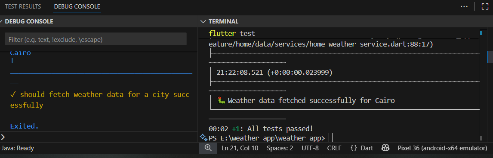

 # 🌦️ Weather App

A clean and well-structured **Flutter application** that displays real-time weather data using the **WeatherAPI**.  
The app allows users to search for any city, view current weather conditions, and save favorite locations locally using SQLite.

---

## 🚀 Features

- 🔍 Search for weather by city name  
- 📍 Detect and use current location automatically (if permissions are granted)  
- 💾 Save favorite cities locally using SQLite  
- 🌡️ View temperature, humidity, and wind speed  
- ☀️ Auto day/night mode based on system theme  
- 📅 View hourly and daily forecasts  

---

## 🛠️ Setup Instructions

### 1️⃣ Clone the repository
```bash
git clone https://github.com/<your-username>/weather_app.git
cd weather_app
2️⃣ Install dependencies
flutter pub get
3️⃣ Create an environment file
flutter run


code is following mvvm and cubit as a statemangment 

lib/
 ├─ feature/
 │   ├─ home/
 │   ├─ favorite/
 │   └─ search/
 │       ├─ data/
 │       │   ├─ models/
 │       │   │   └─ location_model.dart
 │       │   ├─ services/
 │       │   │   └─ search_service.dart
 │       │   └─ repo_impl/
 │       │       └─ search_repository_impl.dart
 │       ├─ domain/
 │       │   └─ repo/
 │       │       └─ search_repository.dart
 │       ├─ presentation/
 │       │   ├─ cubit/
 │       │   │   ├─ search_cubit.dart
 │       │   │   └─ search_state.dart
 │       │   ├─ view/
 │       │   │   └─ search_view.dart
 │       │   └─ widget/
 │       │       ├─ city_search_field.dart
 │       │       ├─ search_empty.dart
 │       │       ├─ search_error.dart
 │       │       └─ weather_card.dart
 ├─ layout/
 ├─ core/
 ├─ app.dart
 └─ main.dart


all test passed ! 
